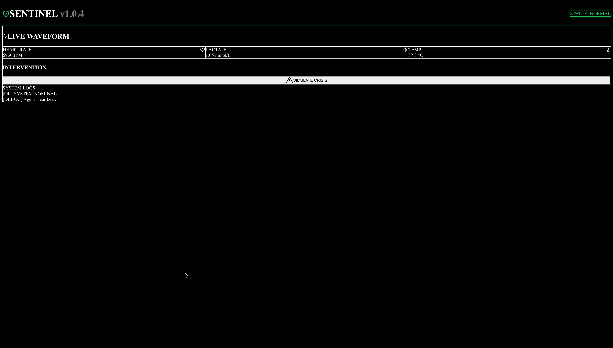

# SENTINEL — Real-Time Multi-Agent Clinical Monitoring System


> **4th place out of 30 teams** — Reply Student Clash 2025 Hackathon

A real-time ICU monitoring system that uses multiple AI agents to process concurrent patient vital streams, detect clinical deterioration patterns, and trigger sub-200ms alerts. Built in 24 hours during a hackathon, demonstrating rapid prototyping of safety-critical systems.



---

## The Problem

In intensive care, patient deterioration can happen within minutes. Traditional monitoring systems trigger alerts based on single-threshold breaches (e.g., heart rate > 120 BPM), generating excessive false alarms. SENTINEL takes a different approach: multiple specialized agents analyze different vital signs simultaneously and reach consensus before escalating, reducing noise while catching real emergencies faster.

---

## Architecture

```
                    ┌──────────────────────────────────┐
                    │     FastAPI Backend (Python)       │
                    │                                    │
                    │  ┌────────────┐  ┌──────────────┐ │
                    │  │  Simulator │  │  Agent Loop   │ │
                    │  │            │  │               │ │
                    │  │ HR  BP  O₂ │  │ Cardiac Agent │ │
                    │  │ Lac Temp   │──│ Sepsis Agent  │ │
                    │  │            │  │ Orchestrator  │ │
                    │  └────────────┘  └──────┬───────┘ │
                    │                         │         │
                    │    REST API (/status)    │         │
                    └─────────────┬────────────┘         │
                                  │                      │
                          JSON @ 10Hz                    │
                                  │                      │
                    ┌─────────────▼────────────────────┐ │
                    │    Next.js Frontend (React)       │ │
                    │                                   │ │
                    │  ┌───────────────────────────┐   │ │
                    │  │    Live Waveform Charts    │   │ │
                    │  │    (Recharts, real-time)   │   │ │
                    │  └───────────────────────────┘   │ │
                    │  ┌─────┐  ┌─────┐  ┌──────┐     │ │
                    │  │ HR  │  │ Lac │  │ Temp │     │ │
                    │  │ BPM │  │mmol │  │  °C  │     │ │
                    │  └─────┘  └─────┘  └──────┘     │ │
                    │  ┌───────────────────────────┐   │ │
                    │  │   System Logs + Alerts     │   │ │
                    │  └───────────────────────────┘   │ │
                    └──────────────────────────────────┘ │
```

---

## How It Works

### Multi-Agent System

SENTINEL uses specialized agents that monitor different clinical domains simultaneously:

**Cardiac Agent** — Monitors heart rate variability (HRV), detects tachycardia and rhythm anomalies. Logs HRV drops during critical events.

**Sepsis Agent** — Tracks the lactate/temperature divergence ratio, a key early indicator of septic shock. Triggers warnings when the ratio exceeds clinical thresholds.

**Orchestrator** — Resolves conflicts between agents when multiple alerts fire simultaneously. Prioritizes interventions based on clinical severity (e.g., cardiac support over temperature management).

### Clinical Simulation

The backend simulates realistic patient vital sign patterns with two modes:

**Normal state** — Physiologically realistic vital signs with natural jitter (HR 60-100, BP 110-130/70-90, SpO₂ 95-100%, Lactate 0.5-1.5, Temp 36.5-37.5°C).

**Septic shock sequence** — Progressive deterioration modeling: tachycardia (HR climbing toward 180), hypotension (BP dropping toward 60/40), rising lactate (up to 10 mmol/L), desaturation, and fever. Each parameter deteriorates at clinically plausible rates.

### Real-Time Frontend

The Next.js dashboard polls the backend at 10Hz (100ms intervals) and renders live waveform charts, color-coded metric cards, and a critical alert overlay with sub-200ms visual response time.

---

## Tech Stack

| Layer | Technology |
|-------|-----------|
| Backend | Python, FastAPI, Async I/O, NumPy |
| Frontend | Next.js 16, React 19, TypeScript |
| Visualization | Recharts (real-time line charts) |
| Styling | Tailwind CSS 4 |
| Icons | Lucide React |

---

## Quick Start

### One-command launch

```bash
chmod +x start_all.sh
./start_all.sh
```

### Manual setup

```bash
# Terminal 1: Backend
cd backend
pip install -r requirements.txt
python orchestrator.py
# → Running on http://localhost:8000

# Terminal 2: Frontend
cd frontend
npm install
npm run dev
# → Running on http://localhost:3000
```

### Usage

1. Open `http://localhost:3000`
2. Observe normal vital signs streaming in real-time
3. Click **SIMULATE CRISIS** to trigger a septic shock sequence
4. Watch the agents detect deterioration and escalate alerts
5. Click **RESET SYSTEM** to return to normal state

---

## API Endpoints

| Method | Endpoint | Description |
|--------|----------|-------------|
| `GET` | `/status` | Returns current vitals and system state (JSON) |
| `POST` | `/simulate-crisis` | Triggers septic shock deterioration sequence |
| `POST` | `/reset` | Resets all vitals to normal baseline |

### Example Response (`GET /status`)

```json
{
  "timestamp": "2025-03-15T14:32:01.234",
  "state": "CRITICAL",
  "vitals": {
    "heart_rate": 142.3,
    "bp_sys": 82.1,
    "bp_dia": 51.4,
    "spo2": 91.2,
    "lactate": 5.73,
    "temp": 39.4
  }
}
```

---

## Project Structure

```
sentinel/
├── backend/
│   ├── orchestrator.py       # FastAPI server, simulator, multi-agent logic
│   └── requirements.txt
├── frontend/
│   ├── app/
│   │   ├── page.tsx          # Main page
│   │   ├── layout.tsx        # Root layout
│   │   └── globals.css       # Global styles
│   ├── components/
│   │   └── Dashboard.tsx     # Real-time monitoring dashboard
│   └── package.json
├── start_all.sh              # One-command launcher
└── README.md
```

---

## Competition Context

SENTINEL was built in **24 hours** during the Reply Student Clash 2025 hackathon, where our team placed **4th out of 30 teams**. The challenge required building an AI-enabled system for real-time clinical decision support.

**What the judges valued:** The multi-agent architecture that separates detection logic by clinical domain, the sub-200ms alert latency, and the realistic simulation of clinical deterioration patterns.

---

## Future Improvements

- LLM integration for natural-language clinical summaries
- Persistent patient history with PostgreSQL
- WebSocket streaming to replace polling
- Additional agents (respiratory, renal, neurological)
- FHIR-compliant data exchange for EHR integration

---

## License

MIT

## Authors

**Sina Farajnia** — [LinkedIn](https://linkedin.com/in/sina-farajnia) · [GitHub](https://github.com/SinaFrj)

Built with the Bit-Polito team at Politecnico di Torino.
